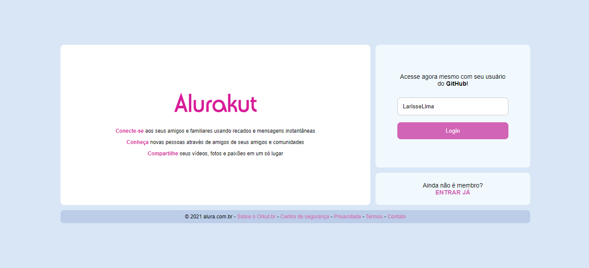
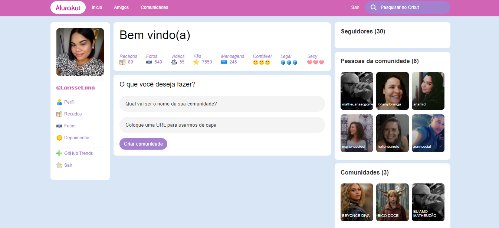

<h1 align="center" >
    
</h1>

# :pushpin: Lista de Conteúdo

- [Sobre](#recycle-sobre)
- [Preview](#iphone)
- [Tecnologias Utilizadas](#clipboard-tecnologias-utilizadas)
- [Instalação e Execução](#desktop_computer-instalação-e-execução)
- [Licença](#scroll-licença)

# :recycle: Sobre

Recriando a maior rede social que já existiu, ORKUT agora vem em ALURAKUT.

# 📱 Preview

<p align="center">
      
   </p>

<p align="center">
      
   </p>

# :clipboard: Tecnologias Utilizadas

- [Yarn](https://yarnpkg.com/)
- [ReactJs](https://reactjs.org/)
- [NextJs](https://nextjs.org/docs/deployment)
- [styled-components](https://github.com/styled-components/styled-components)
- [Vercel](https://vercel.com/new?utm_source=github&utm_medium=readme&utm_campaign=next-example)

# :desktop_computer: Instalação e Execução

**Antes de iniciar, é necessário ter o [NodeJs](https://nodejs.org/en/) ou [Yarn](https://yarnpkg.com/) baixado na máquina**

## Comando para clonar o repositório:

```bash
  #Para clonar o projeto
  git clone https://github.com/LarisseLima/alurakut
```

## Intalar e rodar o APP:

```bash
  #Navegar
  cd alurakut

  #Instalar as dependências
  yarn install

  #Rodar a aplicação web
  yarn dev
```

Vá para http://localhost:3000/login para ver o website.

# :scroll: Licença

Este projeto está sob licença [MIT]()

<p align="center"><b>Feito com 	:coffee: por Larisse Lima</b></p>
